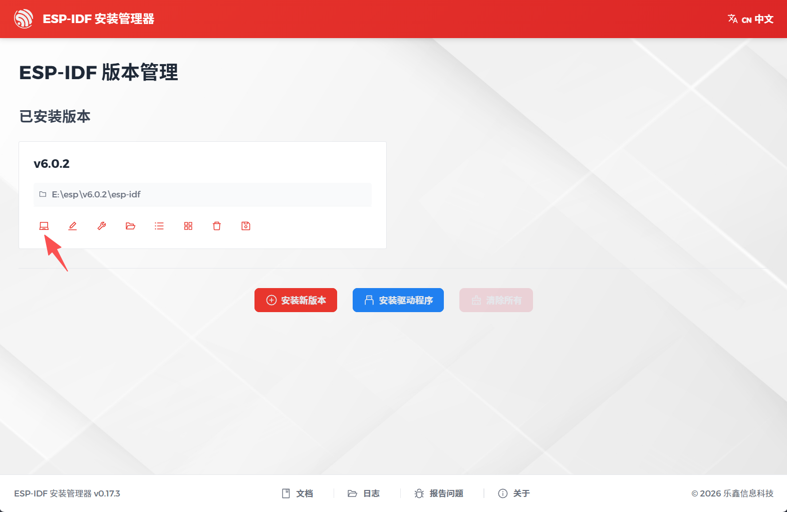

# ESP32-S3 AI Hardware Agent 部署指南

本文介绍如何从零开始，把 AI Hardware Agent 示例工程部署到 ESP32-S3 开发板上并运行。

> **要在新板子 / 新工程上接入 SDK 做一个新 demo？** 请看 [SDK 接入开发指南（以 ESP32-S3 为例）](esp32s3_sdk接入开发指南.md)，本文只负责把这个现成 demo 部署跑起来。

---

## 1. 工程简介

`examples/szpi-esp32s3/` 是一个基于 **ESP32-S3** 的 AI 语音助手示例工程，对接 **AI Hardware Agent SDK**，实现完整的"端侧拾音 → 云端大模型 → 语音合成 → 本地播放"对话闭环。整个界面运行在 LVGL 图形库上，交互直观。

### 1.1 技术栈

| 层级 | 技术                                                    |
| ---- | ------------------------------------------------------- |
| 芯片 | ESP32-S3（16MB Flash + 8MB Octal PSRAM）                |
| 框架 | ESP-IDF 6.0                                             |
| 图形 | LVGL 9.x + ST7789 屏 + FT6336 触摸                      |
| 音频 | I2S + ES8311/ES7210 编解码，G.711A 编码，8k→24k 重采样 |
| 网络 | WiFi + WebSocket（TLS）+ SNTP 校时                      |
| 语音 | AI Hardware Agent SDK（会话/事件/音色管理）             |

### 1.2 主要功能

- **语音对话**：按下 BOOT 按键即可启动/停止会话，端侧拾音，云端返回语音播放
- **顶部状态栏**：显示网络连接状态，并提供硬件音量 `+/−` 调节与实时百分比
- **状态可视化**：中央四根胶囊随空闲 / 监听 / 思考 / 回复 / 断连切换颜色与动画，直观反映当前语音状态
- **音色选择**：长按浮球进入音色面板，可切换多种男女声，切换即时生效并持久化
- **WiFi 配网**：首次上电进入配网界面，引导设备连接网络

### 1.3 工程结构

工程按功能模块分层，职责清晰：

| 目录              | 职责                                                |
| ----------------- | --------------------------------------------------- |
| `board/`        | 板级硬件：LCD、PCA9557 扩展、背光、引脚定义         |
| `audio/`        | 音频编解码抽象 + 板载实现 + 初始化                  |
| `sdk/`          | AI Hardware Agent SDK 对接：事件回调、播放/录音管线 |
| `sdk/platform/` | 平台 HAL：OS、网络、TLS、杂项抽象                   |
| `ui/`           | 图形与界面：LVGL 移植、聊天 UI、面板注册表          |
| `ui/widgets/`   | 状态可视化、顶栏、浮球等控件                        |
| `wifi/`         | WiFi 配网 + 配网界面                                |
| `voice/`        | 音色配置与工厂接口                                  |

### 1.4 运行流程

上电后按顺序完成：硬件初始化 → LCD/音频 → WiFi 配网 → LVGL 界面 → SDK 引擎注册。会话默认不自动启动，需要用户按下 BOOT 按键触发，避免误用云端资源。

---

## 2. 部署环境

### 2.1 安装 ESP-IDF

本项目基于 **ESP-IDF 6.0**（稳定版）。在 [乐鑫官方文档](https://docs.espressif.com/projects/esp-idf/zh_CN/stable/esp32s3/get-started/index.html#get-started-set-up-tools) 找到对应的安装方式。

**Windows 推荐使用官方一键安装器：**

打开 [ESP-IDF Windows 安装器页](https://docs.espressif.com/projects/esp-idf/zh_CN/stable/esp32s3/get-started/windows-setup.html)，按页面操作下载并安装 **ESP-IDF 6.0**。安装完成后，在开始菜单打开 **ESP-IDF 安装管理器**：



> 在 **ESP-IDF 6.0 PowerShell**（已自动激活 ESP-IDF 环境）中直接进入工程目录执行构建/烧录即可，无需手动配置环境变量。构建时若提示缺少工具链（如 `riscv32-esp-elf-gdb`），在 ESP-IDF 目录下执行 `python idf_tools.py install` 安装即可。

### 2.2 安装串口驱动

开发板通过 USB 转串口与电脑通信，需要安装对应驱动：

- 若板载芯片为 **CH340**，从 [沁恒 CH341 驱动下载页](https://www.wch.cn/downloads/CH341SER_EXE.html) 下载安装
- 若板载芯片为 **CP210x**，从 [Silicon Labs 官方下载页](https://www.silabs.com/developer-tools/usb-to-uart-bridge-vcp-drivers) 下载安装

> 安装后可在设备管理器的"端口 (COM 和 LPT)"下看到新增的 COM 口，即为烧录串口。

### 2.3 放置 SDK 库

AI Hardware Agent SDK 由提供方**单独发放**（`ai-hardware-agent-sdk-<version>.tar`），解压后把其中的预编译库 `libconvai_sdk.a` 放到工程根目录下对应的平台目录：

```
<工程根>/libs/esp32-s3/libconvai_sdk.a
```

> 未放置该库时工程会链接到占位实现，无法进行真实对话。若未拿到 SDK 包，请联系项目对接人获取。

### 2.4 依赖组件

工程所需第三方组件（LVGL、触摸驱动、JSON 等）已声明在 `main/idf_component.yml`，首次构建时由 ESP-IDF 组件管理器自动下载，无需手动安装。

### 2.5 配置设备凭证

编译前，需要将设备的五元组信息配置到 `examples/szpi-esp32s3/main/sdk/convai_bridge_defaults.c`（该文件与 GoldieOS 的 `convai_bridge_defaults.c` 逐字节对齐，修改方式一致）。

详细说明（凭证获取、参数含义、宏修改示例）见仓库根目录 README 的 [设备凭证配置](../../../README.md#设备凭证配置) 公共章节。

### 2.6 生成 CJK 字体（可选）

界面内置的 CJK 字体 `main/lv_font_custom_cjk_14.c` / `lv_font_custom_cjk_16.c` 由 `tools/gen_font.js`（基于 `lv_font_conv`）生成，**构建时自动生成、不入库存档**（见 [3.0 前置](#30-前置安装-nodejs--npm首次必需)）。

当你需要**修改界面文案的字符集**、**更换字体源**或**手动重新生成字体**时：

1. 安装字体转换工具依赖（`tools/node_modules` 不入库，需先安装）：

   ```powershell
   cd examples/szpi-esp32s3/tools
   npm install
   ```
2. （可选）重新提取 UI 源码中用到的中文字符集：

   ```powershell
   python gen_chat_font.py -o chat_font_symbols.txt
   ```
3. 手动重新生成 14px / 16px 两个字体文件到 `main/`：

   ```powershell
   node gen_font.js
   ```

> **注意：**
>
> - `gen_font.js` 默认读取字体 `C:\Windows\Fonts\simhei.ttf`（黑体），请确认该字体存在。
> - 生成的 `main/lv_font_custom_cjk_*.c` 会被构建使用；`idf.py build` 时会自动重新生成，一般无需手动执行此节。

---

## 3. 构建

> **先打开 [ESP-IDF 6.0 PowerShell 终端](#21-安装-esp-idf)（已自动激活环境），再在工程目录 `examples/szpi-esp32s3/` 下执行：**

### 3.0 前置：安装 Node.js / npm（首次必需）

CJK 字体由构建时脚本 `tools/gen_font.js` 调用 `lv_font_conv` **自动生成**（字体文件不入库），因此首次构建前需要：

**（1）若系统尚未安装 Node.js / npm：**

1. 打开 [Node.js 官网](https://nodejs.org/) 下载 **LTS 版本**安装包
2. 一路默认安装（自动带上 npm），安装完成后**重启终端**使 `node` / `npm` 可用
3. 验证：

   ```powershell
   node --version
   npm --version
   ```

**（2）安装字体转换工具依赖（`lv_font_conv`）：**

```powershell
cd examples/szpi-esp32s3/tools
npm install
```

> `tools/node_modules` 不入库，仅首次（或依赖缺失时）执行一次即可。

### 3.1 构建

```powershell
cd examples/szpi-esp32s3
idf.py set-target esp32s3
idf.py build
```

> **编译成功判定标准：** 看到 `Project build complete.` 即认为编译成功，可进行烧录。否则说明构建出错，请查看上方报错信息。构建时若提示 `Failed to generate CJK fonts` 或 `npm install failed`，请回到 [3.0 前置](#30-前置安装-nodejs--npm首次必需) 完成 `cd tools && npm install` 后重新构建。

---

## 4. 烧录与运行

### 4.1 首次烧录：先擦除 Flash

**第一次烧录**（或更换新板/之前烧过别的固件）时，建议先**擦除整个 Flash**，清除历史分区/NVS 残留，避免旧数据影响首次配网：

```powershell
idf.py -p <COMx> erase-flash
```

> `erase-flash` 会清空 Flash 中的全部内容（含已保存的 WiFi 凭证、NVS 等）。**只需首次或出问题时执行**，日常重新烧录无需重复擦除。

### 4.2 烧录并查看日志

将开发板通过 USB 连接到电脑，执行：

```powershell
idf.py -p <COMx> flash monitor
```

> 用实际串口号替换 `<COMx>`。`monitor` 会同时打开串口监视器查看运行日志。

---

## 5. 使用说明

**首次配网：**

1. **上电进入配网模式**：首次使用（无已保存 WiFi 凭证）时，设备会自动进入 **AP 配网模式**，LCD 上会显示**热点名称**（形如 `XinZhi-XXXX`）和配置地址 `192.168.4.1`。
2. **连接热点**：用手机/电脑连接该热点（`XinZhi-XXXX`）。
3. **进入配网页并填写 WiFi**：
   - 连接热点后**正常情况下会自动弹出配网页**，选择并填写你的路由器 WiFi 账号密码；
   - 若**没有自动弹出配网页**，则手动打开浏览器，访问屏幕显示的 `192.168.4.1` 进入配网页。
4. 保存后设备会自动连接路由器 WiFi，进入主界面，可开始 AI 对话。

**日常使用：**

1. **启动会话**：连接成功后，**按下 BOOT 按键**开始 AI 对话。
2. **切换音色**：点击或长按浮球进入音色面板，选择后确认即可。

> **重新配网**：如需更换 WiFi，可通过 [4.1 首次烧录](#41-首次烧录先擦除-flash) 的 `idf.py erase-flash` 清空后重新配网，或根据固件提供的重新配网入口操作。

---

## 6. 常见问题

| 现象       | 处理建议                                                           |
| ---------- | ------------------------------------------------------------------ |
| 找不到串口 | 确认已安装串口驱动，并在设备管理器查看 COM 口号                    |
| 没有声音   | 确认功放使能（PA_EN）、音量不为 0、硬件音量可通过顶栏`+/−` 调节 |
| 界面卡顿   | 检查串口日志中的`lvgl heartbeat` 是否持续输出，排查 LVGL 锁冲突  |
| 中文乱码   | 确认源码为 UTF-8 编码，界面中文需使用内置 CJK 字体                 |

---

> 更详细的平台通用说明见仓库根目录的 `README.md`。
